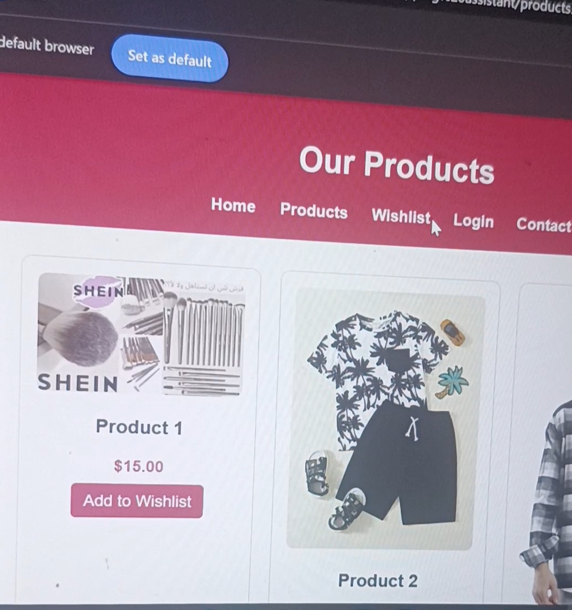

## 📸 Application Screenshots

  
  

# E-Commerce Web Application (Shein-Style Frontend & QA Case Study)

## 📌 Project Overview
A fully responsive E-Commerce web application inspired by fashion platforms like Shein. Designed and developed using modern web technologies to deliver an interactive shopping experience, complete with functional testing for core shopping workflows.

---

## 🛠️ Tech Stack & Tools Used
- **Frontend Technologies:** HTML5, CSS3, JavaScript (ES6+)
- **Testing & QA Tools:** Manual Testing, Browser Compatibility Testing, Google Sheets (Test Cases)

---

## 🌟 Key Features
- **Product Catalog & Filtering:** Interactive product showcase with categories and layout responsiveness.
- **Shopping Cart Functionality:** Add to cart, item counter, and dynamic price calculations using JavaScript.
- **User Interface & UX:** Sleek, modern styling inspired by leading fashion e-commerce sites.

---

## 🧪 QA & Testing Scope
- **UI/UX & Cross-Browser Testing:** Verified seamless layout rendering across modern browsers (Chrome, Edge, Mobile Safari).
- **Cart Logic Testing:** Validated price totals, quantity updates, and edge cases (e.g., empty cart actions).
- **Responsive Web Testing:** Tested mobile and desktop breakpoints to ensure UI consistency.

---

## 📋 Sample Test Case Matrix

| Test Case ID | Feature | Test Scenario | Expected Result | Status |
|-------------|---------|---------------|-----------------|--------|
| TC_EC_001 | Shopping Cart | Add item to cart | Item count increments, cart drawer updates with correct price | PASS |
| TC_EC_002 | UI Layout | Open website on mobile device | Navigation menu collapses into mobile view gracefully | PASS |
| TC_EC_003 | Price Calculation | Update product quantity | Total price recalculates accurately in real-time | PASS |
